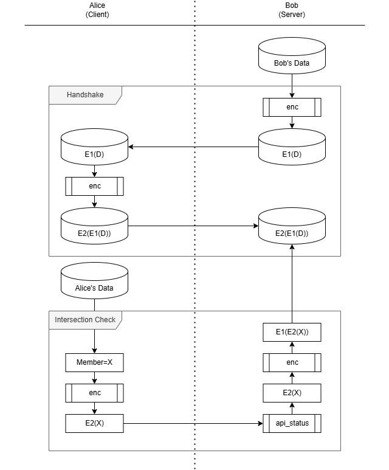
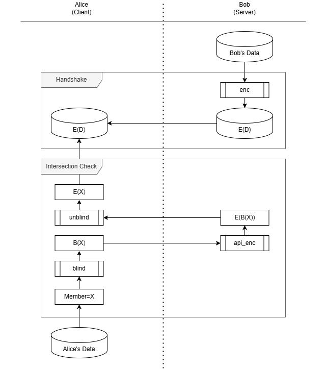

# PSI Python Examples

Private set intersection (PSI) is a way for two parties to share knowledge of overlapping audiences 
without revealing to the other their full audience. This is an example implementation in python.

- [Private set intersection](https://en.wikipedia.org/wiki/Private_set_intersection)

## Double Encryption Agent

This example requires both `Server` and `Client` to encrypt the set which is stored and evaluated
on the `Server.



**Sequence:**
1. The `Server` encrypts raw data into an encrypted set.
2. During handshake, the `Client` fetches the server-encrypted set and double encrypts it with their
   own private key.
3. The double encrypted set is stored on `Server`.
4. To perform a membership check, the `Client` encrypts member values with their private key and
   sends to the server.
5. The `Server` double encrypts the member, and checks if the value exists in the double encrypted
   set.

## Blinding Agent

This example does not require upfront double encryption of the shared set. Instead, the `Client`
requests that the `Server` encrypts numbers on a per-request basis, and checks if the value exists
in the shared set locally. The `Client` avoids oversharing by 'blinding' (encrypting) the raw data 
before sending to the `Server`, and then 'unblinding' (decrypting) the response to reveal the 
server-encrypted value.

Pros
- This solution can be more network efficient if the volume of PSI lookups are low.
- The `Server` can build a single set for multiple clients.



**Sequence:**
1. The `Server` encrypts raw data into and encrypted set. 
2. During handshake, the encrypted set is shared with the `Client`. 
3. To perform a membership check, the `Client` must send member values to the server to be 
   encrypted.
   * To avoid revealing their own private data, the `Client` 'blinds' the value through 
      encryption.
   * The returned value is 'unblinded' through decryption.
4. The `Client` checks if the server-encrypted value exists in the shared set.

## Usage

```
./Scripts/activate
pip install -r requirements.txt
python main.py
```

