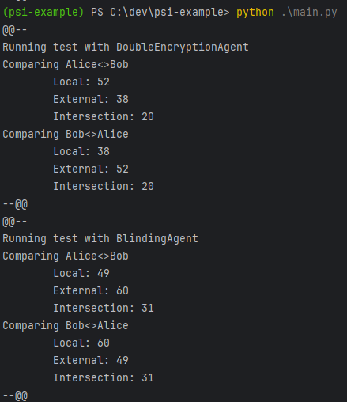

# PSI Python Examples

Private set intersection (PSI) is a way for two parties to share knowledge of overlapping audiences 
without revealing to the other their full audience. This is an example implementation in python.

- [Private set intersection](https://en.wikipedia.org/wiki/Private_set_intersection)
 

## DH Agent

## Blinding Agent

This example does not require upfront double encryption of the shared set. Instead, the `Client`
requests that the `Server` encrypts numbers on a per-request basis, and checks if the value exists
in the shared set locally. The `Client` avoids oversharing by 'blinding' the raw data before 
sending to the `Server`, and then 'unblinding' the response to reveal the server-encrypted value.

Pros
- This solution can be more network efficient if the volume of PSI lookups are low.
- The `Server` can build a single set for multiple clients.


(**Note**: in this sequence I refer to OPRF as "hashing" because it's shorter)

**Sequence:**
1. The `Server` uses EC to hash raw values into a hashed set, which is shared with the `Client`
   without revealing the raw data.
2. The `Client` uses EC to blind its own values before sending to the `Server` to be hashed
3. The `Server` hashes the blinded values using the same method used in step 1.
4. The `Client` unblinds the blinded+hashed values revealing the hashed value. This is used to check
   if their own values are present in the shared set.

## Usage

```
./Scripts/activate
pip install -r requirements.txt
python main.py
```

